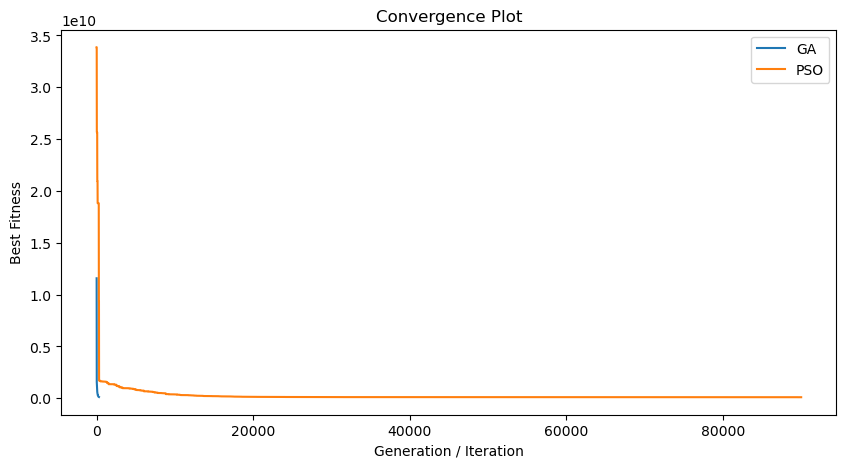
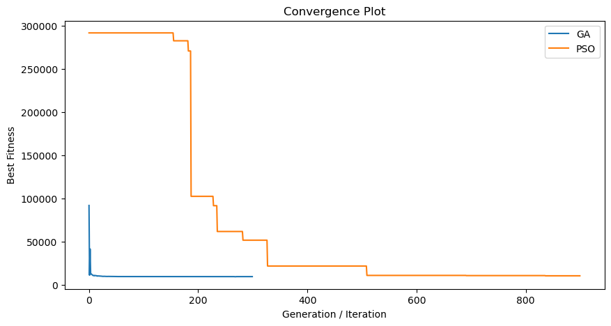
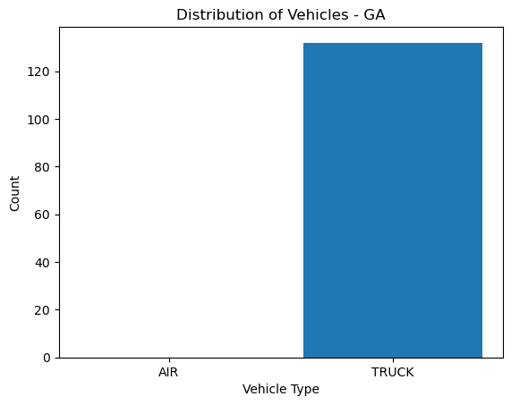
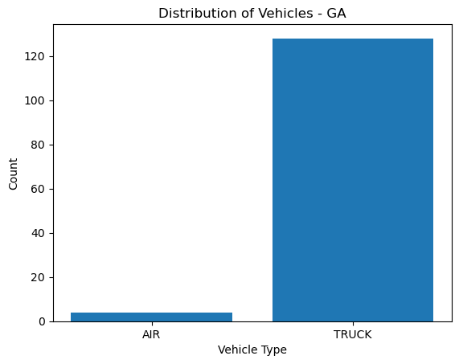
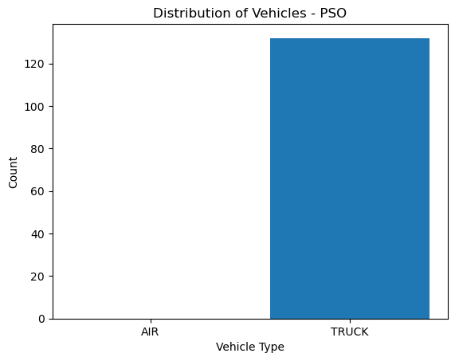
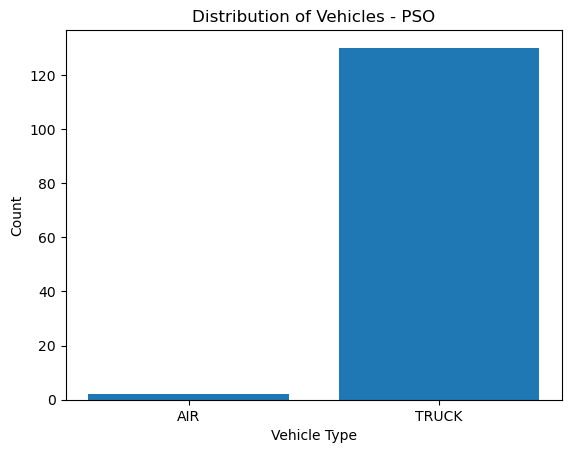
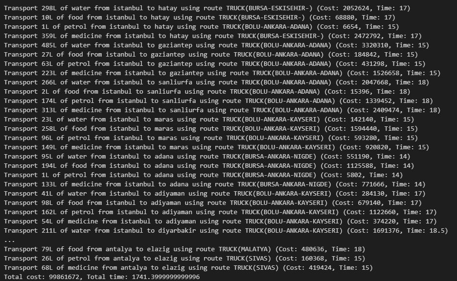

# Post-Earthquake-Relief-Distribution
Trying to find the optimal relief distribution after the earthquake with Genetic Algorithm and Particle Swarm Optimization. Project focuses on the earthquake that happened in February 2023, Maraş.
Ipynb file include two different classes for Genetic Algorithm and Particle Swarm Optimization. 

[IEEE Report for this project](Report-IEEE.pdf)

Genetic Algorithms, Particle Swarm Optimization, Post-Earthquake Relief
Distribution, Distribution with optimization algorithms.

# Introduction

The devastation caused by earthquakes often requires immediate relief
and assistance for the affected communities. It’s during these times of
crisis that effective resource distribution strategies play a
significant role in alleviating suffering and rebuilding the affected
areas. A critical challenge in these situations is the complexity and
unpredictability of the problem space: the extent of damage, the varying
needs of different regions, and the logistical constraints on resources
and transport.

Given the complexity and high-stakes nature of this task, the
application of advanced optimization techniques like Particle Swarm
Optimization (PSO) and Genetic Algorithms (GA) has been proposed. These
techniques can help navigate the complicated problem space by
identifying optimal distribution strategies that maximize relief impact.
However, these algorithms’ effectiveness can vary based on the
complexity of the problem. In this report, I focus on a comparative
study of PSO and GA in solving the post-earthquake relief distribution
problem.

# Problem Formulation

The objective of this study is to formulate the post-earthquake relief
distribution as an optimization problem. The task is to distribute
different types of resources (water, food, petrol, medicine) from
different distribution centers (Istanbul, Ankara, Antalya) to the
affected provinces optimally. The optimization objective is to minimize
the cost and time of delivery, while ensuring that each province
receives the necessary resources.

The problem can be mathematically represented as follows:

Let *C* represent the set of distribution centers, and *P* represent the
set of provinces in need.

For each distribution center *c* ∈ *C*, we have an available amount of
each type of resource, denoted by *A**c*.

For each province *p* ∈ *P*, we have a required amount of each type of
resource, denoted by *R**p*.

For each pair of distribution center and province, we have a cost and
time associated with each transportation mode (i.e., truck, cargo
plane), denoted by *C**O**S**T**c*, *p* and
*T**I**M**E**c*, *p* respectively.

The task is to find a distribution strategy *D**c*, *p* for
each pair of distribution center and province such that:

1\. For each province, the sum of all incoming resources meets or
exceeds the required amount:
∑*c* ∈ *C**D**c*, *p* ≥ *R**p*, for all
*p* ∈ *P*.

2\. For each distribution center, the sum of all outgoing resources does
not exceed the available amount:
∑*p* ∈ *P**D**c*, *p* ≤ *A**c*, for all
*c* ∈ *C*.

3\. The total cost and time are minimized: minimize
∑*c* ∈ *C*∑*p* ∈ *P*(*D**c*, *p*×*C**O**S**T**c*, *p*+*D**c*, *p*×*T**I**M**E**c*, *p*).

# Data

Our dataset represents multiple parameters of post-earthquake scenarios,
including the different regions affected, the type and quantity of
resources required, and the mode of transportation for delivery. The
data was generated and gathered from different sources. Sources are
foundable in the ipynb file as comments whenever they are used. Since
the data was not directly usable, We made some assumptions such as:

## Earthquake Zone Assumptions:

-   Water, food, oil and medicine needs increase in direct proportion to
    the population of the provinces.

-   The effect of the earthquake is not the same in all provinces in the
    earthquake zone. According to the data obtained from the Ministry of
    Strategy and Budget, I determined the need in some provinces as
    ’extreme’ and multiplied the needs in this region with a
    coefficient(it is adjustable).

-   In extreme regions, the need for oil is higher than normal. Because
    more than half of the city has been damaged and almost all of the
    population lives in cars, if any. (There is a need for more oil than
    the coefficient mentioned in the previous item.)

## Distribution Center Assumptions

-   The total material in 3 provinces(Istanbul, Ankara, Antalya) is
    sufficient for needs such as water,food,petrol and medicine in the
    earthquake zone.

-   The supply of water in a province is directly proportional to the
    total cubic meter of water in the dams of that province.

-   The food supply in all provinces is the same.(Couldn’t find relative
    data)

-   The oil supply in a province is directly proportional to the
    distribution of the Oil Terminals.(Let’s underline that we are
    talking about oil terminals, not gas stations.)

-   The supply of medicine in a province is directly proportional to the
    number of repository in that province.

-   The flight cost of a cargo plane is 60.000 USD and the flight time
    is equal to the flight time of the passenger plane.

-   1 dollar is 20 TL

-   A truck burns an average of 32 liters of diesel per 100 km.

## Population of the Provinces(as units)

-   Adana: 220

-   Adiyaman: 70

-   Diyarbakir: 180

-   Gaziantep: 210

-   Hatay: 160

-   Maras: 170

-   Kilis: 10

-   Osmaniye: 56

-   Malatya: 80

-   Sanliurfa: 210

-   Elazig: 59

## Water Availabilities

-   ISTANBUL WATER AVAILABILITY  
    https://www.aski.gov.tr/tr/baraj.aspx

-   ANKARA WATER AVAILABILITY  
    https://www.iski.istanbul/web/tr-TR/baraj-doluluk

-   ANTALYA WATER AVAILABILITY  
    http://web.archive.org/web/20230000000000\*/https://seffaflik.  
    epias.com.tr/transparency/barajlar/aktif-doluluk.xhtml

# Real World Application

The results of this study are not suitable for direct use in case of a
possible earthquake. Real-world problems involve much more complex
parameters to solve. This study is a simulation of it and can only give
’insights’ about the situation. Better orientations can be obtained as a
result of using these algorithms in a possible earthquake scenario. It
can provide better directions to the authority/team directing the
earthquake. It can make solving the problem very short by delivering the
’insights’ to the necessary people in a very short time.

# Methods

This study employed two advanced optimization techniques, Particle Swarm
Optimization (PSO) and Genetic Algorithms (GA), to solve the
post-earthquake relief distribution problem.

## Particle Swarm Optimization

Particle Swarm Optimization (PSO) is a nature-inspired optimization
algorithm based on the movement and intelligence of swarms. The
algorithm is initialized with a group of random solutions and searches
for optimal solutions by updating generations. In each generation, each
particle is updated by two essential components - velocity and position.
Velocity controls the direction of the particle’s movement, while the
position represents the potential solutions. In this study, we used a
variant of PSO where the update of a particle’s position not only
depends on its personal best position but also on the best position
among its neighbors. The weights of the cognitive and social components
(c1 and c2) are important parameters, determining the relative
importance of personal experiences versus the swarm’s collective
knowledge. Additionally, a time coefficient was introduced to address
the critical aspect of relief distribution problems - the timeliness of
deliveries.

## Genetic Algorithms

Genetic Algorithms (GA) is another widely used evolutionary algorithm
that utilizes concepts of genetics and natural evolution, such as
selection, crossover (recombination), and mutation. For the selection
operation, we used tournament selection, which involves running several
"tournaments" among a few individuals (or "chromosomes") chosen at
random from the population. The winner of each tournament (the one with
the best fitness) is selected for crossover. Crossover is the equivalent
of reproduction and biology. During crossover, genes from parents
generate children for the next generation. The mutation operation helps
maintain genetic diversity from one generation of a population to the
next. It alters one or more gene values in a chromosome from its initial
state. In this study, mutation rate and crossover rate were carefully
chosen to maintain a balance between exploration (searching new areas)
and exploitation (refining around a specific area), both critical in
searching an optimal solution.

# Experimental Evaluation

In our experimental evaluations, both PSO and GA were effective in
solving simpler instances of the problem. However, as the problem
complexity increased, GA showed superior performance compared to PSO.
Specifically, GA converged more rapidly to the solution, which is a
crucial factor in time-sensitive scenarios like post-earthquake relief
distribution. This faster convergence rate can be attributed to GA’s
property of maintaining a diverse population, which enables more robust
exploration of the solution space.

On the other hand, the PSO algorithm, despite its potential in certain
scenarios, demonstrated slower convergence. This could be potentially
due to the choice of parameters, requiring further fine-tuning to adapt
to the complexity of the problem. PSO was tried with different
coefficients, naturally better results were obtained with some
coefficients. In the result, none of them passed GA.

Both of the GA and PSO reflects to the time effect. From here we can
deduce that there is no problem in their implementation.

<figure>

<figcaption aria-hidden="true">Convergences of PSO and GA for the Relief
distrubition</figcaption>
</figure>

<figure>

<figcaption aria-hidden="true">Convergences of PSO and GA for a simpler
problem</figcaption>
</figure>

# Conclusion

Through the comparative study of PSO and GA in solving the
post-earthquake relief distribution problem, this report demonstrated
the effectiveness and limitations of these two popular evolutionary
algorithms. Despite their potential, the performance of these algorithms
heavily depends on problem-specific adaptations and fine-tuning.
Particularly in complex, high-stakes scenarios like post-earthquake
relief distribution, these algorithms should be appropriately customized
and thoroughly evaluated to ensure their effectiveness and reliability.
But unexpectedly, GA showed better results than PSO.

<figure>

<figcaption aria-hidden="true">Nearly none time effect</figcaption>
</figure>

<figure>

<figcaption aria-hidden="true">Increased time effect</figcaption>
</figure>

<figure>

<figcaption aria-hidden="true">Nearly none time effect</figcaption>
</figure>

<figure>

<figcaption aria-hidden="true">Increased time effect</figcaption>
</figure>

<figure>

<figcaption aria-hidden="true">Example Output of the
algorithms</figcaption>
</figure>
